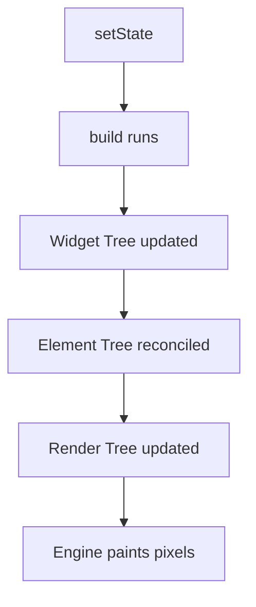

# 🏗️ Flutter Internals: Rendering & Rebuild Observation

Exploring the internal mechanics of how Flutter renders UI and manages widget lifecycles. This module demonstrates the relationship between the Frameowrk, Engine, and Embedder, while observing real-time rebuild patterns.

---

## 🏛️ Flutter Architecture

When asked to explain Flutter's architecture, the key lies in its **layered approach**:

> Flutter follows a layered architecture consisting of **Framework** (Dart-based UI abstraction), **Engine** (C++ Skia/Impeller rendering engine), and **Embedder** (platform-specific integration). It uses a declarative reactive UI model and maintains three trees — **Widget**, **Element**, and **Render** — to efficiently rebuild and render UI components using diffing and GPU acceleration.

### 🔹 The 3 Layers
1. **Framework (Dart):** The top layer providing high-level abstractions like Material, Cupertino, and the Widget system.
2. **Engine (C++):** The core rendering engine (Skia/Impeller) that handles low-level tasks like layout, painting, and accessibility.
3. **Embedder (Platform Specific):** The bridge that allows Flutter to run on Android, iOS, Web, etc.

---

## 🌳 The Three Trees

Flutter manages three distinct trees to optimize performance:

1.  **Widget Tree (Configuration):** A lightweight description of the UI. It is immutable and recreated frequently.
2.  **Element Tree (Lifecycle/State):** The "glue" between Widgets and RenderObjects. It manages state and persistence.
3.  **Render Tree (Layout & Painting):** Handles the actual geometry, layout, and painting of pixels on the screen.

---

## ⚙️ The Rendering Pipeline (Critical for Interviews)

Flutter uses a **Declarative UI Model**. When state changes, the following pipeline is executed:

1.  **`setState()`**: Notifies the framework that the internal state has changed.
2.  **`build()`**: The framework calls the build method to get the new widget configuration.
3.  **Widget Tree**: Updated with the new configuration (immutable).
4.  **Element Tree**: Flutter reconciles the new widget tree with the existing element tree to determine what actually changed.
5.  **Render Tree**: The render objects are updated, and layout/paint operations are performed.
6.  **Painting**: The Engine (Skia/Impeller) paints the pixels on the screen.

---

## 🧪 Observation: Rebuild Behavior

In this experiment (see [main.dart](file:///Users/arpit/StudioProjects/Flutter_Foundation_RoadMap/lib/rendering_rebuild_observation/main.dart)), we use `debugPrint` logs to observe how `setState()` affects the subtree.

### 💡 Critical Insights

| Concept | Explanation |
| :--- | :--- |
| **`setState()`** | Triggers a rebuild of the current widget and its entire subtree. |
| **Stateless Widgets** | These are rebuilt when their parent rebuilds, but Flutter optimizes them via **Element diffing**. |
| **`const` Widgets** | Can skip the rebuild work internally because their configuration is known at compile-time. |
| **Separation of Widgets** | Breaking down large widgets into smaller ones reduces unnecessary rebuild costs and optimizes performance. |

### 🛠️ Experiment Log Pattern
When clicking the FAB in our example:
1. `CounterScreen build` is triggered.
2. `CounterText build` is triggered (receives new state).
3. `StaticLabel build` is triggered (rebuilt because it's a child, but optimized if `const`).

---

## 🚀 Why This Matters
Understanding architecture changes how you write code. It enables you to:
- ⚡ **Optimize Rebuilds**: Know exactly what triggers a redraw.
- 📉 **Reduce Overhead**: Avoid expensive calculations in `build()` methods.
- 🏗️ **Design Scalable Apps**: Build with performance-first principles.

---

> *"Instead of just building UI, understand how Flutter actually renders pixels on screen."*
