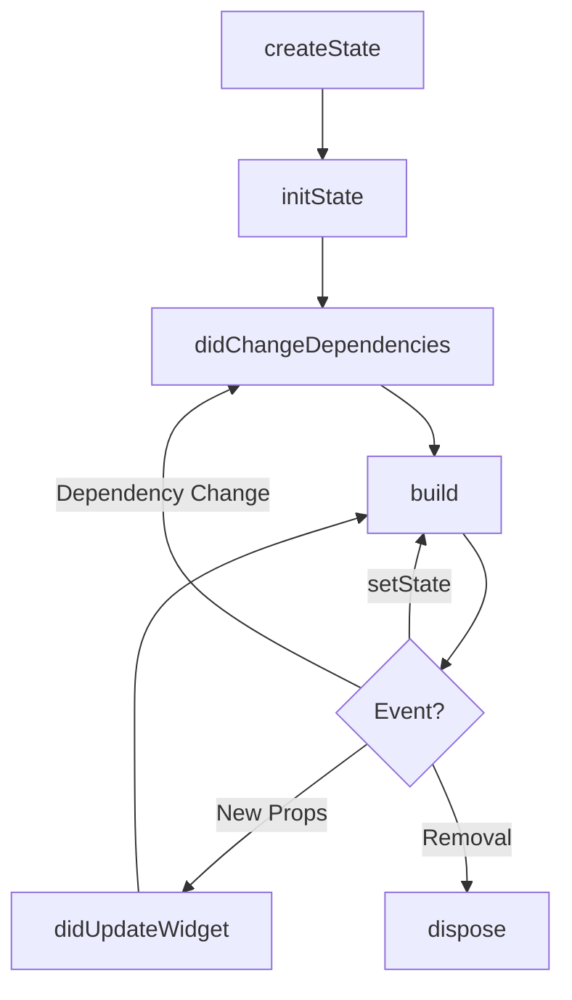

# StatelessWidget & StatefulWidget (Internal & Deep Lifecycle)

Flutter UI is built using two fundamental widget types. Understanding the difference between them and their lifecycle is crucial for building performant and scalable applications.

---

## 🏗 Stateless vs. Stateful: The Comparison

A key architectural decision in Flutter is separating **Configuration** from **Mutable Logic**.
- **Configuration** → `StatefulWidget` (Immutable)
- **Mutable Logic** → `State` (Persistent)

This separation allows Flutter to efficiently update the UI using its reactive model by diffing the widget tree without destroying the underlying state.

### 1. StatelessWidget
*   **Immutability**: Stateless widgets are immutable; their properties cannot change during their lifetime. Once built, they remain the same until the parent removal.
*   **Use Case**: Ideal for static UI elements like Icons, Text, and Buttons that perform one-time actions.
*   **Lifecycle**: Simple. The `build()` method is called once by the parent.
*   **Performance**: Lighter and faster because they don't manage state or listen for internal changes.

### 2. StatefulWidget
*   **Mutability**: Can change state over time in response to user interaction, events, or data changes.
*   **Use Case**: Suitable for dynamic widgets like Forms, Checkboxes, Sliders, or data-driven UI.
*   **Lifecycle**: Complex. Includes `initState`, `setState`, and `dispose`.
*   **Performance**: More resource-intensive due to state management overhead, though Flutter's engine is highly optimized for this.

### 📊 Key Differences at a Glance

| Feature | StatelessWidget | StatefulWidget |
| :--- | :--- | :--- |
| **State Management** | No internal state | Maintains mutable `State` object |
| **Rebuilding** | Only triggered by parent | Can self-trigger via `setState()` |
| **Lifecycle Hooks** | `build()` only | `initState`, `didUpdateWidget`, `dispose`, etc. |
| **Complexity** | Low / Static | High / Dynamic |

---

## 🧬 Lifecycle Flow

The `StatefulWidget` lifecycle allows you to manage resources, handle updates, and clean up memory in a precise sequence.

### Method Breakdown

| Method | Trigger | Use Case |
| :--- | :--- | :--- |
| `initState` | **Only once** when inserted | Initialize controllers or one-time data fetching. |
| `didChangeDependencies` | After `initState` & on **Inherited** updates | React to `Theme`, `MediaQuery`, or `Provider` changes. |
| `build` | High frequency | Constructing the widget tree (Must be pure). |
| `didUpdateWidget` | Parent rebuilds with new props | Syncing internal state with new widget parameters. |
| `dispose` | Permanently removed | Cleanup (closing streams, disposing controllers). |

---

## 🔍 What You Will Observe (Runtime)

When you run the example code and interact with the UI, you will see the following lifecycle events in the terminal:

### ▶️ App Start
1. `initState` (Initialization)
2. `didChangeDependencies` (Context linkage)
3. `build` (Initial render)

### ▶️ Press "Toggle Theme"
1. `MyApp build` (Parent rebuilds)
2. `didUpdateWidget` ✅ (Because the `title` passed from `MyApp` changed)
3. `didChangeDependencies` ✅ (Because the `Theme` InheritedWidget changed)
4. `build` (Re-render with new data)

### ▶️ Press "Print Text"
- **NO rebuild triggered.**
- **Reason**: Accessing or printing values from a `TextEditingController` does not trigger a rebuild. Rebuilds only happen if `setState()` is called or dependencies change.

---

## 🚦 In-Depth Clarifications

### 1. `didChangeDependencies()` vs `didUpdateWidget()`

> [!IMPORTANT]
> - **`didChangeDependencies`**: Reacts to **Context-level** changes (IneritedWidgets like `Theme.of(context)`). This is the earliest safe place to access dependencies.
> - **`didUpdateWidget`**: Reacts to **Constructor-level** changes (when the parent passes new data to this widget).

### 2. The "Theme Animation" Observation
When toggling between Light and Dark mode, `didChangeDependencies` fires many times.
- **Reason**: `MaterialApp` animates the theme colors. Every frame of the transition updates the `Theme` data.
- **Fix**: Use `MaterialApp(themeAnimationDuration: Duration.zero)` to disable this for testing/debugging.

---

## ❓ Knowledge Check: Top 10 Interview Questions

#### Q1: Why is `build()` inside `State` and not `StatefulWidget`?
**A:** Because widgets are immutable and recreated on every rebuild. If `build()` were on the widget, all state would be lost. The `State` object persists across widget instances, allowing data to survive rebuilds.

#### Q2: What is the fundamental difference between Stateless & Stateful?
**A:** Stateless is immutable (data is fixed); Stateful maintains a separate `State` object that allows the widget to change its appearance dynamically even if its configuration remains same.

#### Q3: What happens internally when `setState()` is called?
**A:** It marks the element as "dirty." In the next frame, Flutter schedules a rebuild, compares the old and new widget trees (diffing), and updates the rendered UI accordingly.

#### Q4: Describe the lifecycle flow of a StatefulWidget.
**A:** `createState` → `initState` → `didChangeDependencies` → `build` → (Optional: `didUpdateWidget`/`setState`) → `dispose`.

#### Q5: When is the `dispose()` method critical?
**A:** For cleanup of long-lived resources like **AnimationControllers**, **StreamSubscriptions**, or **TextEditingControllers**. Failure to do so leads to memory leaks.

#### Q6: Why can't we use `context` effectively in `initState()`?
**A:** While the `BuildContext` exists, the widget is not yet fully linked into the inherited widget tree. Methods like `Theme.of(context)` may fail or return outdated data. Use `didChangeDependencies` for this instead.

#### Q7: Difference between `didChangeDependencies` and `didUpdateWidget`?
**A:** `didChangeDependencies` is for external tree changes (InheritedWidgets); `didUpdateWidget` is for internal parameter changes (constructor updates from parent).

#### Q8: When exactly would you use `didUpdateWidget`?
**A:** When your widget receives a new parameter (e.g., a new URL for an image) and you need to restart or update an internal process (like a network request or animation) based on that new data.

#### Q9: What is a real-world use case for `didChangeDependencies`?
**A:** Transitioning between Dark/Light mode, updating UI when the device orientation changes (`MediaQuery`), or reacting to a `Provider` update.

#### Q10: What happens if you forget `dispose()`?
**A:** The app's memory usage grows indefinitely (Memory Leak). Controllers and streams stay alive in the background, which eventually causes performance lag or app crashes.

---

## 💡 When to Use What?

- **StatelessWidget**: Use for static UI, icons, labels, or UI that only depends on constructor arguments.
- **StatefulWidget**: Use for user input (forms), animations, local state (toggles), or complex UI that needs a specific lifecycle.

---

> [!TIP]
> **Performance Tip**: Move your `StatefulWidget` as low as possible in the tree to limit the rebuild scope. If only a button needs to change color, don't make the entire page a `StatefulWidget`.
